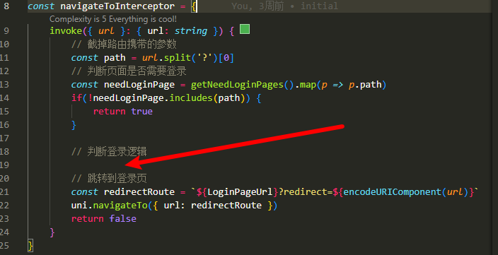
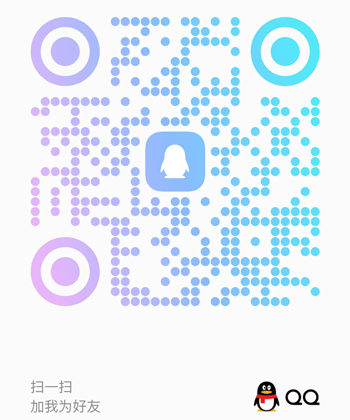

## 开发环境
- node>=18
- pnpm>=7.30
- TypeScript<=5.5.4

<!-- 建议使用pnpm管理依赖包 -->
## 快速开始
执行 `pnpm i` 安装依赖

执行 `pnpm run dev` 或 `pnpm run dev:mp-weixin` 运行 `微信小程序`

## 打包运行（支持热更新）
- weixin平台：`pnpm run dev` 然后打开微信开发者工具，导入本地文件夹，选择本项目的`dist/dev/mp-weixin` 文件。

##  代码发布
- weixin平台：`pnpm build:mp-weixin`, 打包后的文件在 `dist/build/mp-weixin`，然后通过微信开发者工具导入，并点击右上角的“上传”按钮进行上传。

## UI组件库
- Wot-design-Uni `https://wot-design-uni.cn/`
- 自定义UI库主题颜色 `src/style/index.scss`
- 因为使用了 `@uni-helper/vite-plugin-uni-components` 自动引入组件，每当使用新的未注册的组件时需要重启项目来进行UI组件引入

## 样式
- 自定义样式/主题颜色 `src/style/theme.scss`
- 混合样式 `src/style/mixin.scss`

## 跳转拦截
- 在图片指示位置进行登录校验，文件地址 src/utils/route.ts

## 常见问题
1. 打包时warning `Deprecation Warning: Sass @import rules are deprecated and will be removed in Dart Sass 3.0.0.`:
    - 运行时出现一下问题,因为Wot-design-Uni版本与sass版本兼容性问题
    - 解决方案: 将sass版本降到1.79一下

## 技术讨论
有任何的问题、修改意见或者技术交流都可以扫码添加联系方式

 

